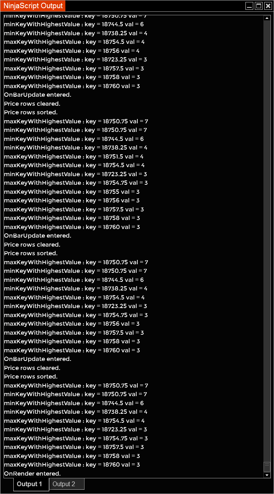

# Price Hit Frequency (PHF) Indicator for NinjaTrader 8

## Description
This NinjaTrader 8 indicator calculates hits on high or low prices of each bar within a specified period and visualizes key levels on the chart.

## Features
- **Lookback Period**: Specify the number of bars to look back.
- **Minimum Hits**: Specify the minimum number of hits required to consider a price level.

## Installation
1. Download the `PHFIndicator.cs` file.
2. Import the file into NinjaTrader 8.

## Usage
Configure the indicator parameters through the NinjaTrader 8 interface:
- **Lookback Period**: Number of bars to look back.
- **Minimum Hits**: Minimum number of hits to consider.

## Example


## Output Window Log
Below is an example of the output window log generated by the PHF Indicator:



## Code Example
```csharp
protected override void OnBarUpdate()
{
    Print("OnBarUpdate entered."); // Debug statement
    if (CurrentBar < barcounter + 2)
        return;

    SortedDictionary<double, double> priceRows = new SortedDictionary<double, double>();
    if (!priceRows.ContainsKey(High[0]))
    {
        priceRows[High[0]] = 1;
    }
    else
    {
        priceRows[High[0]] += 1;
    }

    if (!priceRows.ContainsKey(Low[0]))
    {
        priceRows[Low[0]] = 1;
    }
    else
    {
        priceRows[Low[0]] += 1;
    }

    double zhimax = High[0];
    double zlomin = Low[0];

    for (int i = 0; i < barcounter; i++)
    {
        if (!priceRows.ContainsKey(High[i]))
        {
            priceRows[High[i]] = 1;
        }
        else
        {
            priceRows[High[i]] += 1;
        }

        if (!priceRows.ContainsKey(Low[i]))
        {
            priceRows[Low[i]] = 1;
        }
        else
        {
            priceRows[Low[i]] += 1;
        }

        zhimax = Math.Max(High[i], zhimax);
        zlomin = Math.Min(Low[i], zhimax);
    }

    var sortedDict = (from entry in priceRows
                      orderby entry.Value descending
                      select entry).Take(priceRows.Count)
                      .ToDictionary(pair => pair.Key, pair => pair.Value);

    double maxKeyWithHighestValue = double.MinValue;
    double minKeyWithHighestValue = double.MaxValue;

    foreach (KeyValuePair<double, double> kv in sortedDict)
    {
        if (kv.Value > minhits)
        {
            double highestValue = Math.Max(double.MinValue, kv.Value);
            if (kv.Value >= highestValue * (1 - (100 / 100)))
            {
                if (kv.Key > maxKeyWithHighestValue)
                {
                    maxKeyWithHighestValue = Math.Max(maxKeyWithHighestValue, kv.Key);
                    Print("maxKeyWithHighestValue : key = " + kv.Key.ToString() + " val = " + kv.Value.ToString());
                }

                if (kv.Key < minKeyWithHighestValue)
                {
                    minKeyWithHighestValue = Math.Min(minKeyWithHighestValue, kv.Key);
                    Print("minKeyWithHighestValue : key = " + kv.Key.ToString() + " val = " + kv.Value.ToString());
                }
            }
        }
    }
}
