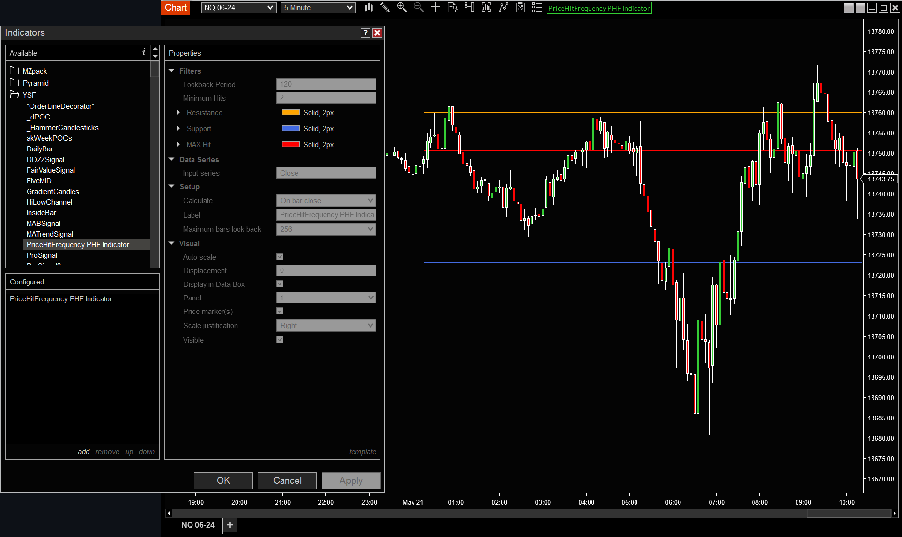
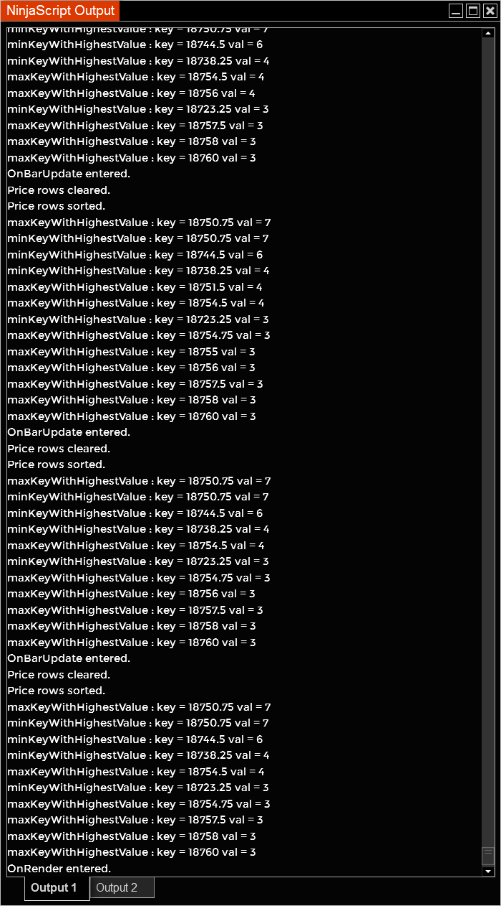

# Usage Guide for Price Hit Frequency (PHF) Indicator

## Overview
The Price Hit Frequency (PHF) Indicator for NinjaTrader 8 calculates hits on high or low prices of each bar within a specified period. This guide provides step-by-step instructions on how to install, configure, and use the PHF Indicator.

## Installation
Follow these steps to install the PHF Indicator into NinjaTrader 8:

1. **Download the Source Code**:
   - Download the `PHFIndicator.cs` file from the [GitHub repository](../src/PHFIndicator.cs).

2. **Import the Indicator into NinjaTrader 8**:
   - Open NinjaTrader 8.
   - Go to the `Tools` menu and select `Import > NinjaScript Add-On`.
   - Browse to the location where you saved `PHFIndicator.cs` and select the file.
   - Follow the prompts to complete the import process.

## Adding the Indicator to a Chart
Once the PHF Indicator is installed, follow these steps to add it to a chart:

1. **Open a Chart**:
   - Open a new or existing chart in NinjaTrader 8.

2. **Add the Indicator**:
   - Right-click on the chart and select `Indicators`.
   - In the `Indicators` window, find `PHF Indicator` in the list and double-click on it to add it to the chart.
   - Configure the indicator settings as desired (detailed below).
   - Click `OK` to apply the indicator to the chart.

## Configuring the Indicator
The PHF Indicator has several configurable parameters that allow you to customize its behavior:

- **Lookback Period**: The number of bars to look back for calculating hits.
- **Minimum Hits**: The minimum number of hits required to consider a price level.

To configure these parameters:

1. **Open the Indicator Settings**:
   - Right-click on the chart and select `Indicators`.
   - In the `Indicators` window, select `PHF Indicator`.

2. **Adjust the Parameters**:
   - Modify the `Lookback Period` to your desired value. This controls how many bars the indicator will look back to calculate hits.
   - Modify the `Minimum Hits` to your desired value. This controls the threshold for considering a price level.

3. **Apply the Changes**:
   - Click `OK` to save your changes and apply the indicator to the chart.

## Using the Indicator
The PHF Indicator visualizes key levels on the chart where the high or low prices of bars have been hit frequently within the specified lookback period. These levels can help identify areas of support and resistance.

### Example Usage
1. **Identify Support and Resistance**:
   - Use the PHF Indicator to identify price levels that have been frequently hit. These levels can act as potential support or resistance.

2. **Adjust Parameters for Different Time Frames**:
   - You may need to adjust the `Lookback Period` and `Minimum Hits` parameters depending on the time frame of your chart and the specific market you are trading.

## Example Configuration
Here is an example of how you might configure the PHF Indicator for a daily chart:

- **Lookback Period**: 20 (looking back 20 days)
- **Minimum Hits**: 3 (only consider levels that have been hit at least 3 times)

## Example Configuration
Here is an example of how you might configure the PHF Indicator for a daily chart:

- **Lookback Period**: 20 (looking back 20 days)
- **Minimum Hits**: 3 (only consider levels that have been hit at least 3 times)

## Example

## Troubleshooting
If you encounter any issues while using the PHF Indicator, consider the following troubleshooting steps:

- **Check the NinjaScript Output Window**: Look for any error messages or debug prints that can help identify the issue.
- **Review Parameter Settings**: Ensure that the `Lookback Period` and `Minimum Hits` are set to appropriate values for your chart and market.

## Output Window Log
The PHF Indicator generates logs that can be viewed in the NinjaTrader output window. Here's an example of the output:

## Conclusion
The PHF Indicator is a powerful tool for identifying frequently hit price levels, which can act as significant support or resistance levels. By customizing the parameters, you can tailor the indicator to suit your specific trading needs and time frames.

For any further assistance, feel free to refer to the detailed documentation provided or contact the developer through the [GitHub repository](https://github.com/your-repo-url).
